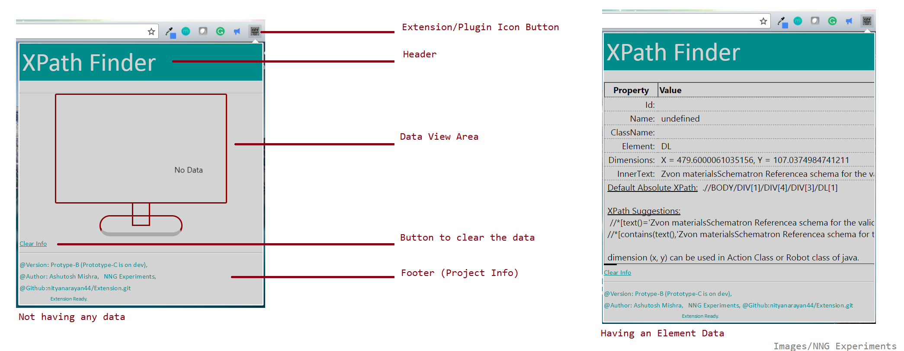

'##.....##.../######......########:      
. ##...##....##........##...##....       
:. ##.##.....##.......##....##           
::. ###.......######.......######:::     
:: ##.##.....##...............##...        
: ##...##....##::::::.........##           
 ##......##...##::::::.........##          
..:::::..::..:::::::::..:::::...::::::.....:::.. 

+-----------------------------------------+       
| @Date		     : 09 Nov 2017					  
| @Last updated	 : 24 Jun 2022					  
| @Author	     : Ashutosh Mishra				  
| @Github	     : nityanarayan44/Extension.git	  
| Doc Meta	     : Created on Windows 8.1/Mac	  
+-------------------------------------------+     

this is some desc.

#Images

